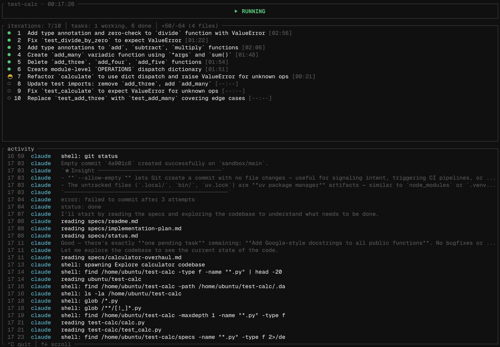

# so

A sandbox orchestrator for your agents.



## Why so?

Run coding agents in isolated sandboxes so they can't break your host. Changes stay contained until you review and merge them back into your codebase.

## Features

- Isolated sandbox per run with bwrap or docker
- Multi-agent support: claude, opencode, codex
- Interactive review menu: diff, shell, reset, merge

## Installation

```bash
cargo install sono
```

### Requirements

**Bubblewrap** (recommended):

```bash
sudo apt install bubblewrap
```

> Note: Ubuntu 24.04+ blocks unprivileged user namespaces for bwrap with AppArmor. The recommended fix is below.

```bash
sudo tee /etc/apparmor.d/bwrap <<'EOF'
abi <abi/4.0>,
include <tunables/global>

profile bwrap /usr/bin/bwrap flags=(default_allow) {
  userns,
  include if exists <local/bwrap>
}
EOF
sudo systemctl restart apparmor
```

**Docker**:

macOS:

```bash
brew install --cask docker
```

Linux:

- Refer to the install guide from [docker](https://docs.docker.com/engine/install/)

## Usage

Create a plan:

```bash
so plan
```

Edit `specs/*.md` for any changes.

Run the agent in a sandbox (default: docker):

```bash
so run
```

Choose a harness and iterations:

```bash
so run -H claude -i 5
so run -H codex -i 3
so run -H opencode -i 2
```

Iterations only (defaults to claude):

```bash
so run -i 5
```

Use docker explicitly:

```bash
so run -s docker
```

Use bubblewrap:

```bash
so run -s bwrap
```

## Commands

| Command | Description                            |
| ------- | -------------------------------------- |
| `plan`  | Generate implementation plan and specs |
| `run`   | Run agent in sandbox                   |
| `step`  | Run with human-in-the-loop             |
| `clean` | Fix code smells                        |
| `dup`   | Remove duplicate code                  |
| `learn` | Guided learning session                |
| `menu`  | Manage existing sandboxes              |

## Workflow

1. `so plan` creates `specs/` directory with prompt template
2. Edit `specs/*.md` with any modifications
3. `so run` runs agent in isolated sandbox
4. Review changes with diff, shell into sandbox, reset and pick commit
5. Merge when satisfied and changes are squashed into your codebase

## Options

| Flag               | Default  | Description                    |
| ------------------ | -------- | ------------------------------ |
| `-H, --harness`    | `claude` | Agent: claude, opencode, codex |
| `-i, --iterations` | `10`     | Number of iterations           |
| `-s, --sandbox`    | `docker` | Sandbox type: docker, bwrap    |
| `-m, --model`      | -        | Model override                 |
| `-e, --effort`     | -        | Effort level for reasoning     |

Set model and effort:

```bash
so run -H opencode -m openai/gpt-5.2-codex -e medium
```

> Note: Setting `SANDBOX` as an environment variable is the same as `--sandbox`.

Set persistent defaults in `~/.config/so/config.toml`:

```toml
harness = "opencode"
iterations = 5
sandbox = "docker"
model = "openai/gpt-5.2-codex"
effort = "medium"
```

> Note: All fields are optional. CLI flags take priority.

## Inspiration

- [FastRender](https://simonwillison.net/2026/Jan/23/fastrender/) - Cursor's parallel agent coordination harness
- [The Ralph Wiggum Loop](https://www.youtube.com/watch?v=4Nna09dG_c0) - Better context window management
